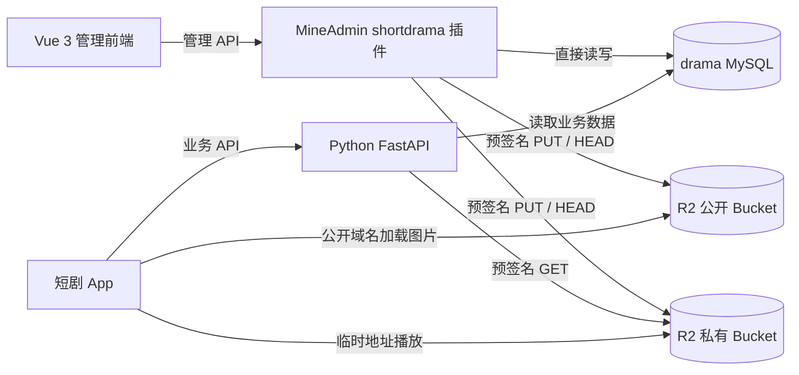
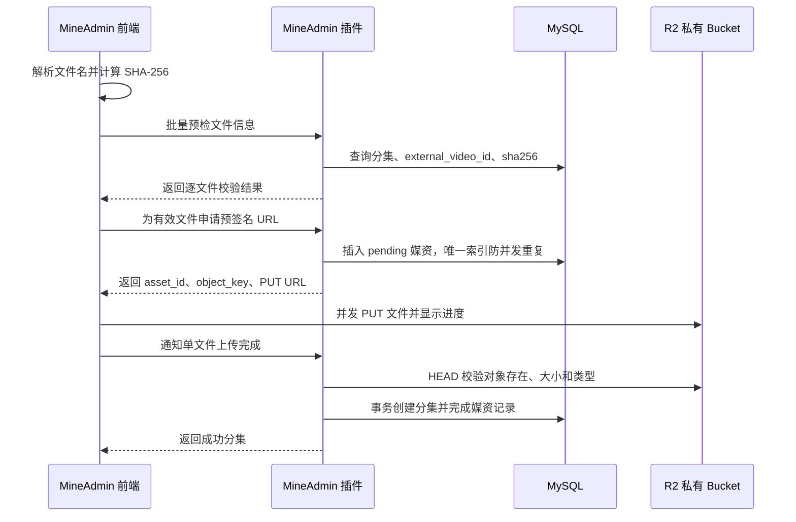

# 短剧管理后台 MVP 设计规格

**日期**：2026-06-12

**最后修订**：2026-06-14

**版本**：v2.0
**状态**：设计确认，待实施计划

> 本文档是短剧管理后台 MVP 的实现依据。需求变化应先更新本文档，再修改代码。

## 1. 项目目标

基于 MineAdmin 3.0 构建一个前后端分离的短剧运营后台，与现有 Python FastAPI 服务直接共享 `drama` MySQL 业务库。

MVP 解决以下问题：

- 运营人员可以录入、编辑、上下架短剧和分集。
- 图片和视频上传到 Cloudflare R2，不把二进制文件存入 MySQL。
- 支持一次选择多个小视频，并发计算哈希、校验和上传。
- 自动识别分集文件名并创建分集。
- 管理 App 用户状态，但不覆盖 App 用户资料。
- 提供实时概览和短剧排行。
- 复用 MineAdmin 的登录、JWT、RBAC、菜单和操作日志。

## 2. 已确认范围

### 2.1 MVP 模块

| 模块 | MVP 功能 |
|---|---|
| 数据看板 | 短剧数、分集数、用户数、总播放量、总点赞量、短剧排行、状态分布 |
| 短剧管理 | 新增、编辑、封面上传、状态切换、批量上下架、查看分集 |
| 分集管理 | 新增、编辑、海报上传、全部播放器配置、批量上下架、批量视频上传 |
| 表格批量导入 | Excel 元数据导入；有效行继续、错误行跳过并生成错误报告 |
| 用户管理 | 用户资料只读；允许禁用和恢复账号 |
| 系统与权限 | 复用 MineAdmin 的管理员、角色、菜单权限和操作日志 |

### 2.2 不进入 MVP

- 评论管理。
- 内容审核工作流。
- 物理删除短剧、分集和用户。
- 视频转码、多清晰度、截图、内容识别和 CDN 编排。
- 历史视频哈希回填。
- 自动清理 R2 孤立对象。
- 播放、新增用户等按日趋势图。
- 推荐位、会员计费和复杂运营活动。

## 3. 技术基线

以本机 MineAdmin 3.0 代码为实现基线：

| 层级 | 技术 |
|---|---|
| 管理后端 | PHP 8.1+、Hyperf 3.1、Swoole 5+、MineAdmin 3.0 |
| 管理前端 | Vue 3.5、TypeScript、Vite 5、Element Plus 2.9 |
| 表格与表单 | `@mineadmin/pro-table`、`@mineadmin/form`、`@mineadmin/search` |
| App 服务 | Python FastAPI、Peewee ORM |
| 数据库 | MySQL 5.7 兼容结构，生产建议 MySQL 8.0+ |
| 文件存储 | Cloudflare R2，S3 兼容 API，公开与私有双 Bucket |
| 图表 | ECharts 5 |

旧设计中的 `MaCrud` 和 `MineAdmin.json` 不适用于当前 MineAdmin 3.0 基线。实现应使用 MaProTable 和 `mine.json` 插件清单。

## 4. 总体架构



### 4.1 前后端分离

- MineAdmin 后端插件位于 `plugin/shortdrama/src`，提供业务 API、权限、数据库访问和 R2 签名。
- MineAdmin 前端插件位于 `plugin/shortdrama/web`，提供 Vue 页面、API 客户端和上传组件。
- 前端构建为静态资源，MineAdmin 后端和 FastAPI 独立运行。
- FastAPI 继续面向 App；MineAdmin API 只面向管理后台。

### 4.2 数据所有权

| 数据 | 主要写入方 | 说明 |
|---|---|---|
| 短剧、分集、媒资 | MineAdmin | 运营后台负责创建和维护 |
| 用户昵称、头像 | App + FastAPI | 管理后台只读，避免双端覆盖 |
| 用户状态 | MineAdmin | FastAPI 必须执行禁用校验 |
| 点赞、收藏、播放进度、分享、统计 | App + FastAPI | 管理后台只读聚合 |

## 5. MineAdmin 插件结构

```text
plugin/shortdrama/
├── mine.json
├── src/
│   ├── ConfigProvider.php
│   ├── Controller/
│   │   ├── DashboardController.php
│   │   ├── DramaController.php
│   │   ├── EpisodeController.php
│   │   ├── MediaUploadController.php
│   │   ├── ImportController.php
│   │   └── AppUserController.php
│   ├── Request/
│   ├── Service/
│   │   ├── DashboardService.php
│   │   ├── DramaService.php
│   │   ├── EpisodeService.php
│   │   ├── MediaUploadService.php
│   │   └── ImportService.php
│   ├── Model/
│   └── Database/Migrations/
└── web/
    ├── api/
    ├── views/
    │   ├── dashboard/
    │   ├── drama/
    │   ├── episode/
    │   ├── import/
    │   └── user/
    └── components/
        └── batch-video-upload/
```

业务模型统一使用 `drama` 数据库连接；MineAdmin 系统模型继续使用默认系统库连接。

## 6. 角色与权限

MVP 只配置两个角色。

### 6.1 超级管理员

- 拥有全部业务和系统权限。
- 管理管理员、角色、菜单、字典和系统配置。
- 配置 Cloudflare R2、固定系统作者和上传限制。
- 可以覆盖自动生成的 `external_drama_id` 与 `external_video_id`，但仍必须通过唯一性和格式校验。

### 6.2 运营

- 查看数据看板。
- 新增、编辑、批量导入和上下架短剧。
- 新增、编辑、批量上传和上下架分集。
- 批量上传成功后直接发布分集。
- 查看 App 用户，禁用或恢复账号。
- 不可管理系统权限、管理员账号和 R2 密钥配置。

所有写操作接入 MineAdmin 操作日志。日志不得记录 R2 Secret、完整预签名 URL 或其他凭证。

## 7. 状态与删除规则

### 7.1 短剧状态

`dramas.status` 统一定义为：

| 值 | 含义 | App 可见 |
|---|---|---|
| `0` | 下架 | 否 |
| `1` | 连载 | 是 |
| `2` | 完结 | 是 |

FastAPI 所有可见短剧查询必须从 `status == 1` 改为 `status IN (1, 2)`，`isFinished` 继续由 `status == 2` 计算。

### 7.2 分集状态

| 值 | 含义 | App 可见 |
|---|---|---|
| `0` | 下架 | 否 |
| `1` | 上架 | 是 |

### 7.3 禁止删除

- 短剧和分集不提供删除按钮或 DELETE API。
- 内容退出展示使用下架状态，不破坏播放记录、统计和用户关系。
- 用户不删除，只允许禁用和恢复。

## 8. Cloudflare R2 设计

### 8.1 双 Bucket

| Bucket | 内容 | 访问方式 |
|---|---|---|
| 公开 Bucket | 短剧封面、分集海报 | 绑定自定义域名公开读取 |
| 私有 Bucket | 原始分集视频 | 私有；预签名 PUT 上传，预签名 GET 播放 |

预签名 URL 必须使用 R2 S3 API 域名，不能把主机名替换成公开自定义域名。

### 8.2 配置项

```env
R2_ACCOUNT_ID=
R2_ACCESS_KEY_ID=
R2_SECRET_ACCESS_KEY=
R2_ENDPOINT=https://<account-id>.r2.cloudflarestorage.com
R2_REGION=auto
R2_PUBLIC_BUCKET=shortdrama-public
R2_PRIVATE_BUCKET=shortdrama-private
R2_PUBLIC_BASE_URL=https://media.example.com
R2_UPLOAD_URL_TTL=900
R2_PLAY_URL_TTL=600
R2_UPLOAD_CONCURRENCY=3
SHORTDRAMA_AUTHOR_USER_ID=10001
```

R2 凭证只保存在服务器环境变量中，不下发到浏览器。两个服务可使用各自的最小权限凭证。

### 8.3 CORS

R2 Bucket 允许管理后台来源执行 `PUT` 和预检请求，允许上传所需的 `Content-Type` 与校验和请求头，并按需暴露 `ETag`。对象存在性由 MineAdmin 后端执行 HEAD 校验，不依赖浏览器 CORS。生产环境只允许明确的后台域名，不使用通配来源。

## 9. 媒资数据模型

允许新增 `media_assets` 表。MVP 只为启用新上传流程后的视频创建记录，不回填历史视频。

### 9.1 建议字段

| 字段 | 类型建议 | 说明 |
|---|---|---|
| `id` | BIGINT PK | 媒资 ID |
| `episode_id` | BIGINT NULL UNIQUE | 上传完成后关联分集 |
| `bucket` | VARCHAR(100) | 私有 Bucket 名称 |
| `object_key` | VARCHAR(1024) UNIQUE | R2 对象键 |
| `sha256` | CHAR(64) UNIQUE | 文件内容哈希 |
| `original_name` | VARCHAR(255) | 原始文件名 |
| `file_size` | BIGINT | 字节数 |
| `mime_type` | VARCHAR(100) | MVP 仅接受 `video/mp4` |
| `upload_status` | TINYINT | `0=pending, 1=uploaded, 2=completed, 3=failed` |
| `failure_reason` | VARCHAR(500) NULL | 可恢复错误说明 |
| `reservation_expires_at` | DATETIME NULL | pending 哈希占位过期时间 |
| `uploaded_by` | BIGINT | MineAdmin 管理员 ID，不建跨库外键 |
| `created_at` / `updated_at` | DATETIME | 时间戳 |

### 9.2 唯一性规则

- `sha256` 唯一：相同视频内容禁止再次上传或复用。
- `object_key` 唯一：同一 R2 对象键只允许一条记录。
- `episode_id` 唯一：一个分集只能关联一个新媒资记录。
- `drama_episodes` 已有 `(drama_id, episode_no)` 与 `external_video_id` 唯一索引作为最终兜底。
- pending 占位设置有限有效期；过期且未发现 R2 对象时可被新请求安全接管，避免浏览器异常退出后永久阻塞该哈希。

历史视频没有 `media_assets` 记录，不能参与 SHA-256 去重。这是 MVP 接受的限制。

## 10. 批量视频上传

### 10.1 文件命名

```text
文件名：{external_drama_id}_ep{集号}.mp4
示例：D202606120001_ep01.mp4

external_video_id：D202606120001_ep01
episode_no：1
```

- `external_drama_id` 必须与当前选择短剧一致。
- 集号至少两位，超过 99 后自然扩展为 `ep100`。
- 同一短剧集号已存在时禁止上传，不允许覆盖。
- 文件名不符合规则时不计算哈希、不签发上传地址。

### 10.2 前端处理

- 一次选择多个 MP4 文件。
- 单文件最大 500 MB。
- 使用 Web Worker 和增量 SHA-256 库分块读取，避免阻塞 UI 或一次性占用完整文件内存。
- 哈希计算并发建议 `1-2`，R2 上传并发默认 `3`，通过配置调整。
- 预签名 PUT 绑定 `Content-Type`，并携带 SHA-256 校验和请求头验证传输完整性；R2 `ETag` 不作为文件内容哈希。
- 每个文件独立显示：等待、计算哈希、校验、上传、入库、成功、失败。
- 有效文件继续处理，失败文件单独标红，可移除或单独重试。

### 10.3 三层校验

1. **文件名校验**：扩展名、短剧 ID、`ep` 集号格式。
2. **业务校验**：分集号和 `external_video_id` 是否已经存在。
3. **内容校验**：`sha256` 是否已存在；命中时提示关联短剧、集号和原文件名。

超级管理员也不能绕过内容哈希和集号冲突校验。

### 10.4 上传与入库流程



### 10.5 自动创建分集

上传完成后自动创建分集：

- 标题默认 `第 01 集`。
- `external_video_id` 和 `episode_no` 从文件名解析。
- `play_url` 保存 R2 私有对象键，不保存临时签名 URL。
- `poster_url` 默认复用短剧封面，运营可后续替换。
- 播放器配置使用系统默认值，之后可在分集表单编辑全部字段。
- `status` 默认 `1`，成功入库后立即在 App 可见。
- 上传前必须显示发布提醒和确认项。

`dramas.total_episodes` 由运营手工维护。页面统一显示：

```text
已上传/总集数：72/80
```

“已上传”按当前分集记录数实时统计，批量上传不自动修改总集数。

### 10.6 异常恢复

- 上传失败：保留文件行和已计算哈希，允许重新申请 URL 后重试。
- 签名过期：重新申请签名，不重复计算哈希。
- R2 成功但入库失败：保留媒资异常状态，运营重试完成入库；MVP 不自动删除对象。
- `complete` 接口必须幂等；重复调用返回已创建分集。
- 多人同时上传相同文件时，由数据库唯一索引保证只有一个 pending 记录成功。
- 定时任务或申请接口可以回收已过期、无 R2 对象的 pending 占位；存在对象的记录转为可恢复状态，不直接删除对象。

## 11. 图片上传

- 短剧封面和分集海报通过公开 Bucket 的预签名 PUT 直传。
- 上传完成后保存 `R2_PUBLIC_BASE_URL + object_key` 的稳定公开 URL。
- 数据库不新增图片媒资记录；MVP 不提供图片哈希去重和孤立图片清理。
- 上传成功且 HEAD 校验通过后，表单才允许保存图片 URL。

## 12. 页面与 UI 规范

### 12.1 视觉基线

- 沿用 MineAdmin 经典布局：左侧菜单、顶部工具栏、面包屑和矩形标签栏。
- 使用 Element Plus 和 MaProTable，不重新实现基础表格、表单、抽屉和消息组件。
- 主色使用 MineAdmin 默认蓝 `#2563EB`，其余使用 Element Plus 语义色。
- 使用统一线性 SVG/Iconify 图标，不使用 Emoji 作为结构图标。
- 使用 4/8 px 间距体系，卡片圆角 6-8 px，阴影克制。
- 数字列使用等宽数字；状态同时使用颜色、图标和文字，不只依赖颜色。
- 统计卡片中的数字和说明文字水平居中。

### 12.2 响应式

- 桌面宽度使用完整侧栏。
- 窄于约 1050 px 时折叠为图标侧栏，保留工具提示。
- 表格优先固定重要列，必要时允许表格区域横向滚动，不让整页横向滚动。
- 所有图标按钮具有可见焦点和 `aria-label`。
- 动画时长控制在 150-300 ms，并支持 `prefers-reduced-motion`。

### 12.3 短剧管理页

- MaProTable 搜索：短剧名称、外部编号、分类、状态。
- 操作：新增、编辑、查看分集、批量上架、批量下架、Excel 导入。
- 列：封面、标题与编号、分类、状态、已上传/总集数、播放量、追剧数、更新时间。
- 编辑使用 Element Plus 抽屉，分组展示基础信息、封面和归属信息。

### 12.4 分集管理页

- 搜索：短剧、集号、外部视频 ID、状态。
- 编辑所有播放器字段，布尔字段用开关，`tool_info_json` 使用代码输入框和 JSON 格式校验。
- 提供单集编辑、批量上下架和批量上传入口，不提供删除。

### 12.5 批量上传页

- 顶部展示 `已上传/总集数`、本次文件数和上传并发数。
- 文件表合并展示文件与分集信息，减少横向宽度。
- 显示总体进度和逐文件状态。
- 冲突行使用浅红背景，并在对应状态下直接说明原因和恢复操作。
- 只有一个主操作按钮“开始上传”，其他操作降低视觉权重。

## 13. Excel 批量导入

- 提供短剧和分集元数据模板。
- Excel 不包含二进制文件；视频优先使用批量视频上传器。
- 每行独立校验，合法行继续导入，错误行跳过。
- 导入结果返回成功数、失败数和可下载错误报告，报告包含行号、字段和原因。
- 重复 `external_drama_id`、`external_video_id` 或 `(drama_id, episode_no)` 不覆盖现有记录。
- 导入过程使用分批事务，避免一个错误回滚全部有效行。

## 14. 用户管理

- 展示用户 ID、外部 ID、昵称、头像、状态、注册时间。
- 详情只读展示观看进度和收藏记录。
- 后台不修改昵称和头像。
- 允许运营禁用和恢复用户。
- FastAPI 必须在身份识别或受保护业务入口检查 `users.status`，禁用用户不得继续执行需要账号身份的操作。

## 15. 数据看板

MVP 只提供现有表可以实时计算的指标：

- 短剧总数、分集总数、App 用户总数。
- 总播放量、总点赞量。
- 按播放量、点赞量、追剧数切换的 Top 20 排行。
- 短剧状态分布和分类分布。

不展示 7 天或 30 天趋势，因为当前数据结构缺少可靠的按日快照。

## 16. 管理 API

接口统一使用 MineAdmin `/admin/shortdrama` 前缀，并由 MineAdmin JWT 与 RBAC 中间件保护。

### 16.1 看板

| 方法 | 路径 | 说明 |
|---|---|---|
| GET | `/dashboard/overview` | 核心指标 |
| GET | `/dashboard/ranking` | 短剧排行 |
| GET | `/dashboard/distribution` | 状态和分类分布 |

### 16.2 短剧

| 方法 | 路径 | 说明 |
|---|---|---|
| GET | `/dramas` | 分页和筛选 |
| POST | `/dramas` | 新增短剧 |
| PUT | `/dramas/{id}` | 编辑短剧 |
| POST | `/dramas/batch-status` | 批量上下架或设置完结 |

### 16.3 分集

| 方法 | 路径 | 说明 |
|---|---|---|
| GET | `/episodes` | 分页和筛选 |
| POST | `/episodes` | 手工新增分集 |
| PUT | `/episodes/{id}` | 编辑分集与播放器配置 |
| POST | `/episodes/batch-status` | 批量上下架 |

### 16.4 媒资上传

| 方法 | 路径 | 说明 |
|---|---|---|
| POST | `/episodes/upload/check` | 批量文件名、集号和哈希预检 |
| POST | `/episodes/upload/presign` | 占位媒资并签发单文件 PUT URL |
| POST | `/episodes/upload/complete` | HEAD 校验、创建分集、完成媒资 |
| GET | `/episodes/upload/status/{assetId}` | 查询单文件处理状态 |
| POST | `/images/upload/presign` | 封面或海报 PUT URL |
| POST | `/images/upload/complete` | 校验并返回公开 URL |

### 16.5 用户和导入

| 方法 | 路径 | 说明 |
|---|---|---|
| GET | `/users` | 用户列表 |
| GET | `/users/{id}` | 只读详情 |
| PUT | `/users/{id}/status` | 禁用或恢复 |
| POST | `/imports/validate` | 校验 Excel |
| POST | `/imports/execute` | 执行部分成功导入 |
| GET | `/imports/{id}/report` | 下载错误报告 |

所有写接口使用统一响应结构和字段级校验错误。批量接口返回逐项结果，不用单个 HTTP 状态隐藏部分失败信息。

## 17. FastAPI 必要改造

MVP 允许对现有 Python 服务做以下兼容性修改：

1. 短剧可见条件改为 `Drama.status.in_([1, 2])`。
2. `isFinished` 继续使用 `drama.status == 2`。
3. 返回短剧封面时优先使用 `drama.cover_url`；历史数据为空时才回退旧静态路径规则。
4. 分集 `play_url` 自动识别：
   - 以 `http://` 或 `https://` 开头时，按历史完整 URL 原样返回。
   - 其他值视为 R2 私有对象键，生成短期 GET 预签名 URL。
5. 签名失败时返回明确播放错误，不回传 R2 凭证或裸对象键。
6. 禁用用户在需要身份的业务入口被拒绝。

该方案不迁移历史 `play_url`，允许历史 URL 与新 R2 对象键长期并存。

## 18. 错误处理

| 场景 | 行为 |
|---|---|
| 数据库连接失败 | 返回统一服务错误并记录服务端日志，不暴露连接信息 |
| 分集或外部 ID 冲突 | 返回冲突记录和可读原因，不签发上传地址 |
| SHA-256 重复 | 返回已关联短剧、集号和原文件名，禁止上传 |
| R2 签名失败 | 当前文件失败，其他文件继续 |
| R2 PUT 失败 | 保留哈希与文件行，允许重新申请 URL 重试 |
| 完成接口 HEAD 不通过 | 不创建分集，提示重新上传或重试校验 |
| R2 成功但数据库失败 | 保留可恢复媒资状态，允许重试完成，不自动删除对象 |
| JSON 配置无效 | 字段级报错，阻止保存分集 |
| Excel 行错误 | 跳过该行并写入错误报告，其他有效行继续 |
| 无权限 | MineAdmin 返回 401/403，前端隐藏无权操作并处理直接请求 |

## 19. 测试策略

### 19.1 后端单元测试

- 文件名解析：合法、错误短剧 ID、缺少集号、三位集号、错误扩展名。
- 状态转换和禁止删除规则。
- SHA-256 重复和唯一索引冲突。
- `complete` 接口幂等性。
- Excel 逐行校验和部分成功汇总。
- 看板聚合 SQL。

### 19.2 集成测试

- MineAdmin 连接 `drama` 数据库读写。
- R2 预签名 PUT、HEAD 和 GET；开发环境可用独立测试 Bucket。
- 上传成功后媒资与分集事务一致性。
- 多请求并发上传同一哈希只有一个成功占位。
- 历史 HTTP URL 原样返回，新对象键生成签名 URL。
- `status=2` 的完结短剧在 App 正常可见。
- 禁用用户被 FastAPI 正确拒绝。

### 19.3 前端测试

- MaProTable 搜索、分页、状态标签和权限按钮。
- 多文件选择、哈希进度、上传并发限制和单项重试。
- 部分失败不阻断有效文件。
- 窄屏侧栏折叠、表格滚动和抽屉布局。
- 键盘焦点、图标按钮标签和状态非颜色提示。

## 20. MVP 验收标准

1. 超级管理员和运营可以按权限登录和操作，运营无法访问系统配置。
2. 运营可以新增短剧、上传公开封面并设置下架、连载或完结。
3. 运营可以一次选择多个规范命名视频，看到逐文件哈希、校验和上传进度。
4. 已存在集号、外部视频 ID 或新系统已知 SHA-256 时，文件被明确阻止。
5. 有效文件在其他文件失败时仍能成功上传、创建分集并立即上架。
6. 新分集 `play_url` 保存 R2 对象键，App 获得短时播放地址。
7. 历史完整视频 URL 仍能播放，历史数据无需迁移或哈希回填。
8. 页面显示 `已上传/总集数：72/80`，上传不会修改运营填写的总集数。
9. 短剧和分集没有删除入口，批量状态操作正常。
10. 用户资料只读，禁用和恢复能被 FastAPI 实际执行。
11. UI 与已确认的 MineAdmin 高保真预览一致。

## 21. 实施顺序建议

1. 安装 MineAdmin 3.0 基线并配置双数据库连接。
2. 创建 `shortdrama` 插件、菜单和两个角色权限。
3. 新增 `media_assets` 迁移与模型。
4. 实现短剧、分集和用户管理 API。
5. 实现 Cloudflare R2 双 Bucket 配置和签名服务。
6. 实现批量视频上传后端状态机。
7. 实现 MineAdmin 高保真前端页面和 Web Worker 哈希。
8. 实现 Excel 导入与数据看板。
9. 修改 FastAPI 的状态、封面、视频签名和用户禁用逻辑。
10. 完成集成测试、权限验收和 R2 CORS 检查。

## 22. 后续迭代

- 视频转码、多清晰度和截图。
- 媒资引用管理与孤立对象清理。
- 历史媒资扫描和哈希回填。
- 内容审核、驳回原因和版本记录。
- 推荐位、会员付费和运营活动。
- 按日统计表和趋势分析。
- CDN 缓存策略、播放防盗链和更细粒度凭证。

## 23. 参考资料

- [MineAdmin 官方站点](https://www.mineadmin.com/)
- [MineAdmin GitHub](https://github.com/mineadmin)
- [Cloudflare R2 S3 API](https://developers.cloudflare.com/r2/api/s3/api/)
- [Cloudflare R2 预签名 URL](https://developers.cloudflare.com/r2/api/s3/presigned-urls/)
- [Cloudflare R2 CORS](https://developers.cloudflare.com/r2/buckets/cors/)
- [Cloudflare R2 上传对象](https://developers.cloudflare.com/r2/objects/upload-objects/)

## 24. 修订记录

| 日期 | 版本 | 内容 |
|---|---|---|
| 2026-06-12 | v1.0 | 初始 MineAdmin 后台设计 |
| 2026-06-14 | v2.0 | 重写并确认 MVP：MineAdmin 3.0、MaProTable、高保真 UI、Cloudflare R2 双 Bucket、批量哈希去重、媒资表、两个角色、FastAPI 兼容 |
